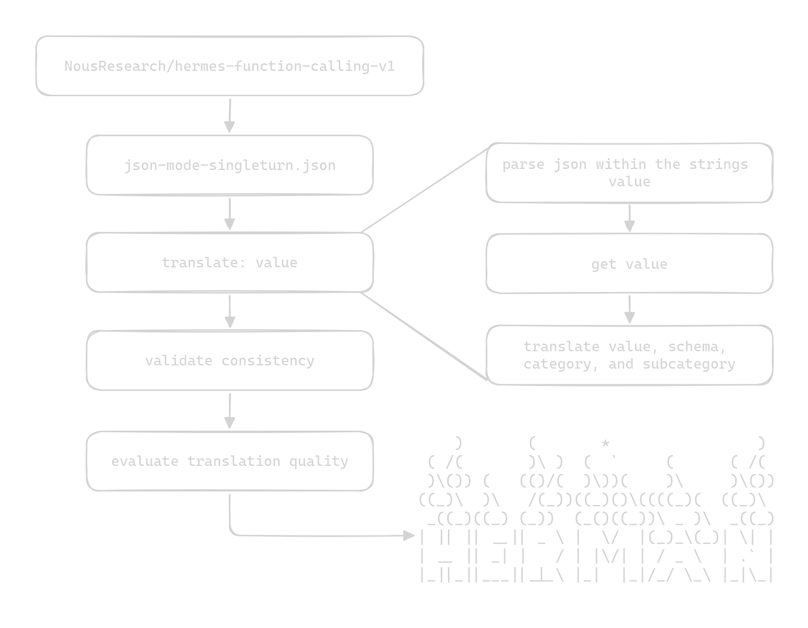

# [Hermes -> Herman: Adaptasi Bahasa Indonesia](https://huggingface.co/datasets/SulthanAbiyyu/herman-json-mode)

**Herman** adalah dataset berbahasa Indonesia yang dirancang khusus untuk pelatihan LLM menggunakan mode JSON single-turn. Dataset ini digunakan dalam pelatihan Supervised Fine-Tuning (SFT) untuk meningkatkan kemampuan parsing JSON pada LLM. Herman diperoleh dari [Hermes](https://huggingface.co/datasets/NousResearch/hermes-function-calling-v1) dan diterjemahkan ke dalam bahasa Indonesia untuk keperluan pelatihan model bahasa Indonesia.

## Metodologi

<picture>
  <source media="(prefers-color-scheme: dark)" srcset="./imgs/dark-diagram.png">
  <source media="(prefers-color-scheme: light)" srcset="./imgs/light-diagram.png">
  
</picture>

## Format Skema

Skema JSON yang diinginkan dapat dimasukkan ke dalam system prompt dengan menggunakan tag `<schema>` dan closing tag `</schema>`.

```json
<schema>
{
  "title": "nama skema",
  "type": "object",
  "properties": {
    "nama_properti_1": {
      "title": "judul properti",
      "type": "tipe data",
      "format": "format data"
    },
    ...,
    ...
  },
  "required": ["nama_properti_1", ...]
}
</schema>
```

1. `title`: Nama atau judul dari schema JSON.
2. `type`: Menentukan tipe utama dari schema, biasanya object.
3. `properties`: Daftar properti/key yang perlu dicari.

- `title`: Nama atau deskripsi singkat dari properti tersebut. Merupakan label yang menjelaskan apa yang dimaksud dengan properti ini.
- `type`: Tipe data. Misalnya `string` (teks), `number` (angka), `boolean` (nilai benar/salah), `object` (objek nested), dll.
- `format (opsional)`: Format spesifik untuk properti, jika diperlukan. Misalnya, untuk `type`: `string`, `format`: `date` berarti menunjukkan bahwa nilai properti harus berupa tanggal.

4. `required`: Daftar properti yang harus ada dalam objek JSON.

---

# [Hermes -> Herman: Indonesian Adaptation](https://huggingface.co/datasets/SulthanAbiyyu/herman-json-mode)

**Herman** is an Indonesian language dataset specifically designed for training LLMs using a single-turn JSON mode. This dataset is used in Supervised Fine-Tuning (SFT) to improve JSON parsing capabilities in LLMs. Herman was obtained from [Hermes](https://huggingface.co/datasets/NousResearch/hermes-function-calling-v1) and translated into Indonesian for the purpose of training Indonesian language models.

## Schema Format

The desired JSON schema can be included in the system prompt using the `<schema>` tag and the closing `</schema>` tag.

```json
<schema>
{
  "title": "schema name",
  "type": "object",
  "properties": {
    "property_name_1": {
      "title": "property title",
      "type": "data type",
      "format": "data format"
    },
    ...,
    ...
  },
  "required": ["property_name_1", ...]
}
</schema>
```

1. `title`: The name or title of the JSON schema.
2. `type`: Specifies the main type of the schema, usually `object`.
3. `properties`: A list of properties/keys to be looked for.

   - `title`: The name or brief description of the property. It is a label that explains what this property is about.
   - `type`: The data type. For example, `string` (text), `number` (numeric), `boolean` (true/false), `object` (nested object), etc.
   - `format` (optional): Specific format for the property, if needed. For example, for `type`: `string`, `format`: `date` indicates that the property's value should be a date.

4. `required`: A list of properties that must be present in the JSON object.

## Wujud Herman


